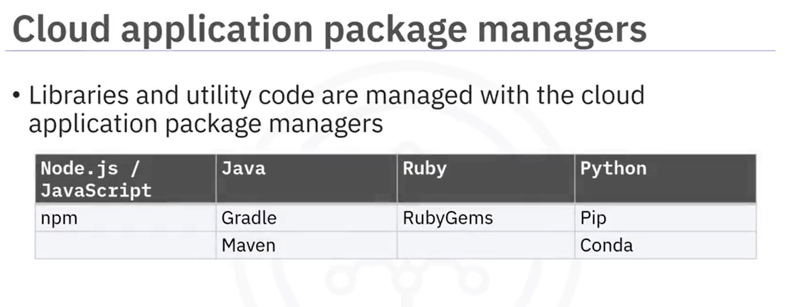

# More appplication dev tools
## Applcation Dev Tools :
### Build Tools :
**Webpack** -> Module bundler for JavaScript
**Babel** -> JavaScript compiler
**Web Assembly** -> Binary Instructions format that runs in the browser

### Packages Managers
Libraries and utilities codes are managed with the cloud aplications pachages managers
- Node.js and JavaScript:
**npm**

- Java
**gradle**, **Maven**

- Ruby
**RubyGems**

- Pyton
**Pip**, **Conda**

